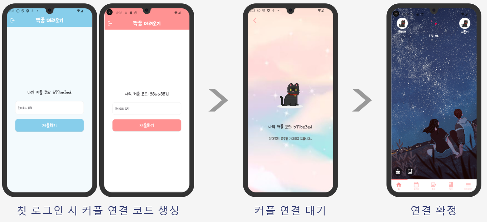
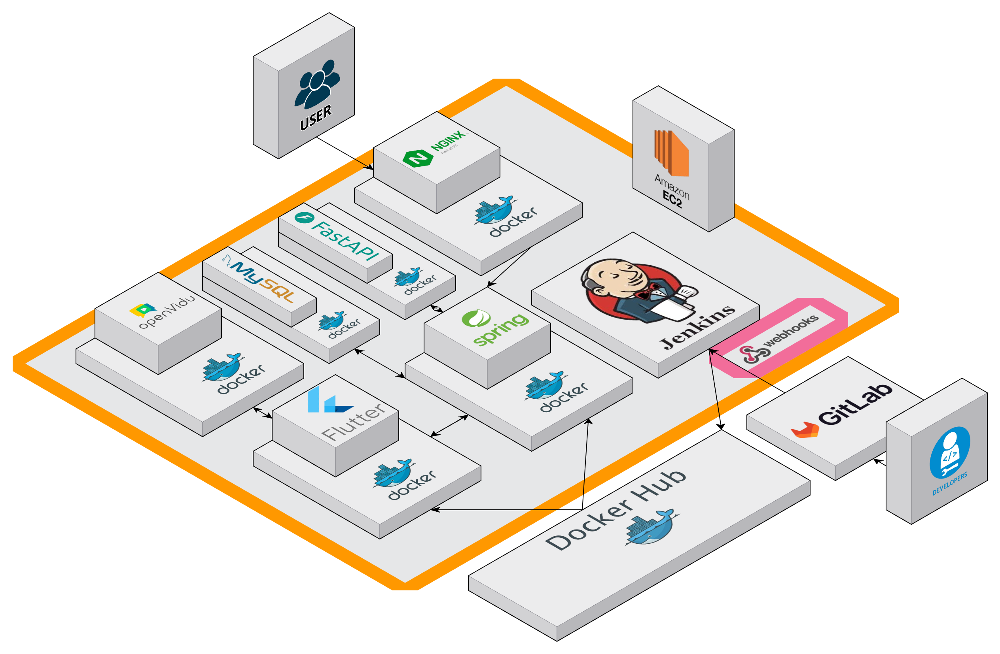

# DayLog
<h1 align="center">
  

  <div>연인들을 위한 소통 앱</div>
</h1>

# :one: 프로젝트 개요

## 1. 개발 기간

| 개발기간 | 24.07.08 ~ 24.08.16 |
| --- | --- |

## 2. 구성 팀

| 팀원 | 역할 | 세부 내용 | 
| --- | --- | --- |
| 김예영 | Back-End Developer | BE, DB |
| 김진우 | Front-End Developer | FE, 디자인 |
| 박준영 | Front-End Developer | FE, 디자인, WebRTC 통신 |
| 조규범 | Front-End Developer | FE, 디자인 |
| 조성빈 | Back-End Developer, Infra | BE, DB |
| 한지훈 | Back-End Developer, Infra | BE, DB, 영상 AI |

## 3. 기획 의도 및 목표
연인들은 영상통화를 통해 일상을 공유하고 재미있는 대화를 나누며 추억을 쌓습니다.   
DayLog는 연인들이 영상통화 중 나눈 재미있고 중요한 대화의 하이라이트를 AI를 통해 클립으로 생성하고, 커플의 추억을 관리하는 앱입니다.

:star: 목표
| No | Content | 세부 내용 | 
| --- | -------------------- | ----- |
| 1 | 연인들을 위한 소통 앱 기능 | 영상통화, 캘린더, 일정 공유, 그림일기 기능 |
| 2 | 편의성을 위한 영상 편집 기능 | 영상통화 핫클립 제작 기능 |

</br>  
</br>  

# :two: 서비스 기능 소개

<h1 align="center">
  
</h1>

## 1. lottie 애니메이션 이미지 사용   

- 로딩 및 화면 구성 중 lottie를 사용하여 화면을 구성하였습니다.   

  

## 2. 회원가입 화면   

- 유저는 회원가입의 화면을 통해 이메일, 비밀번호, 전화번호를 입력하고 아이디를 만들 수 있습니다.   

  

## 3. Couple Matching   

- 커플 매칭 기능   
  : 커플 매칭은 회원가입 이후 커플 연결 코드를 통해 서로 연결됩니다.   
   
  

## 4. 홈 화면   

- 커플은 홈 화면에서 사귄 날짜 설정, 배경화면 설정을 할 수 있습니다.

  

## 5. 캘린더 화면

- 커플은 캘린더에서 서로의 일정을 공유하거나 핫클립 확인 기능을 사용할 수 있습니다.

  

## 6. 영상통화 화면

- 영상통화 화면은 lottie화면으로 구성하였고 비디오 통화에서는 화면 변경, 마이크 끄기, 카메라 전후방 변경 기능을 사용할 수 있습니다.

  
  

## 7. 다이어리 화면

- 유저는 다이어리를 통해 서로의 일기를 작성하고 일기는 AI 그림으로 작성되어 저장됩니다.   

  


## 8. 셋팅 화면

- 공지사항, 테마, 비밀번호 설정, 로그아웃, 회원탈퇴 등의 기능을 사용할 수 있습니다.

  


</br>  
</br>  

# :three: 기술 스택   

## Frontend
  - React
  - Tailwind CSS
  - HTML
  - JavaScript
  - ReactQuery
  - Zustand

## Backend
  - Java 17
  - SpringBoot 3
  - SpringSecurity
  - SSE
  - MySQL 8.0.23
  - Redis
  - Spring Data JPA
  - QueryDSL
  - AWS Lambda, S3
  - Thymeleaf

## Infra
  - AWS EC2
  - Docker
  - Docker Compose
  - Jenkins
  - NGINX
  - Ubuntu 20.04

</br>  
</br>  

# :four: 아키텍처   
<h1 align="center">
    
</h1>
  

</br>  
</br>  
  
# :five: 기대효과  
<h1 align="center">
  
</h1>

# :six: 적용 기술 세부사항

- 추후 작성

# :seven: Git Graph 및 문서 구조


```

```